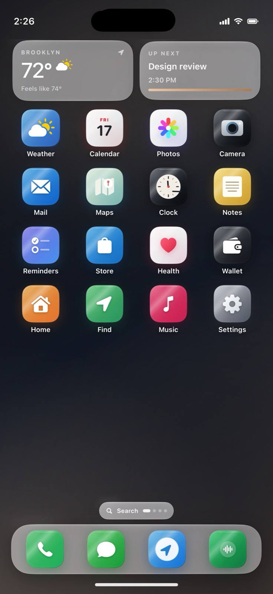

# Indica OS

A SwiftUI study of a phone interface: lock screen, launcher, app switching, notification and control panels, settings, and small in-app experiences.

Indica runs inside an ordinary iOS application. It does not replace the operating system. Some views store local data, some connect to external APIs, and others demonstrate an interaction using sample data.



*Screenshot from the earlier prototype. The current source includes subsequent reliability and accessibility changes; a fresh simulator capture is still needed.*

## Run

Requires Xcode 26 or newer with an iOS SDK. The deployment target is iOS 17; native glass effects use an availability-guarded iOS 26 path, with a material fallback on earlier runtimes.

1. Open `IndicaOS.xcodeproj`.
2. Select the shared `IndicaOS` scheme and an iPhone simulator.
3. Run. A simulator build does not require a signing team. For a physical device, choose your own team and bundle identifier in Signing & Capabilities.

```sh
xcodebuild -project IndicaOS.xcodeproj -scheme IndicaOS \
  -sdk iphonesimulator -configuration Debug CODE_SIGNING_ALLOWED=NO build
```

The source parses locally, the project/property lists validate, and the extracted calculator engine passes 13 checks. **The complete iOS app has not been rebuilt in this release review because Xcode is not installed on the review machine.** The included GitHub workflow performs that build after upload; no passing CI status is claimed before it runs.

## What is implemented

| Area | Behavior |
| --- | --- |
| Shell | Boot, lock, home pages, app switching, overlays, search, and navigation |
| Local state | Notes, reminders, messages, and appearance preferences stored on device |
| Calculator | Tested immediate-execution arithmetic, decimal input, clear, sign, percentage, and division errors |
| Spotify | PKCE sign-in, profile, top tracks, and one refresh/retry when an access token expires |
| Assistant connections | Developer API request flows using credentials in the device Keychain |
| Other service entries | Setup information and links where an integration is not implemented |
| Demo apps | Sample data and simulated behavior for views such as wallet, health, devices, passwords, and voice memos |

The demo password vault has no real authentication and accepts no real secrets. Voice Memos demonstrates recording states and elapsed time without capturing microphone audio. Service permission declarations do not mean every related system feature is implemented.

## Connections

Spotify requires your own developer client ID. Configure it in Settings → Developer Integrations and register `indicaos://oauth/spotify` as the redirect URI. Account eligibility and developer app access are controlled by Spotify. Tokens remain in the device Keychain.

OpenAI and Anthropic screens use developer API credentials and configurable model identifiers. Consumer subscriptions and chat histories are separate. Keys must be entered at runtime; none belong in this repository. API calls may incur provider charges.

Disconnecting removes the corresponding local credentials. Network flows have not been exercised against live accounts in this release review.

## Code map

| File | Responsibility |
| --- | --- |
| `SystemModels.swift` | Shell state, settings, and local models |
| `SystemShell.swift` | Launcher, overlays, icons, and shared surface styling |
| `CoreApps.swift`, `EverydayApps.swift` | In-app views |
| `CalculatorEngine.swift` | UI-independent arithmetic state machine |
| `Connections.swift` | Service configuration, OAuth, Keychain, and network requests |
| `SettingsSystem.swift` | Settings navigation and controls |
| `ContentView.swift`, `Haptics.swift` | Root environment and feedback |

OS text-size preferences, Reduce Motion, and Reduce Transparency are respected alongside the app's own controls. Accessibility across every simulated app still needs a device/simulator review, especially at the largest text sizes.

## Tests and release checks

```sh
swiftc IndicaOS/CalculatorEngine.swift Tests/CalculatorTests.swift -o /tmp/calculator-tests
/tmp/calculator-tests
```

The arithmetic engine is shared by the app and these tests. The checks cover operator replacement, chaining, repeated equals, decimals, negative backspace, clear, percentage, and division-by-zero recovery. See [the release checklist](docs/release-checks.md) for remaining simulator and account verification.

MIT licensed source. Apple, Spotify, and other service names identify referenced platforms. Their marks, system artwork, and third-party content are not relicensed by this project. Indica is an independent prototype.
